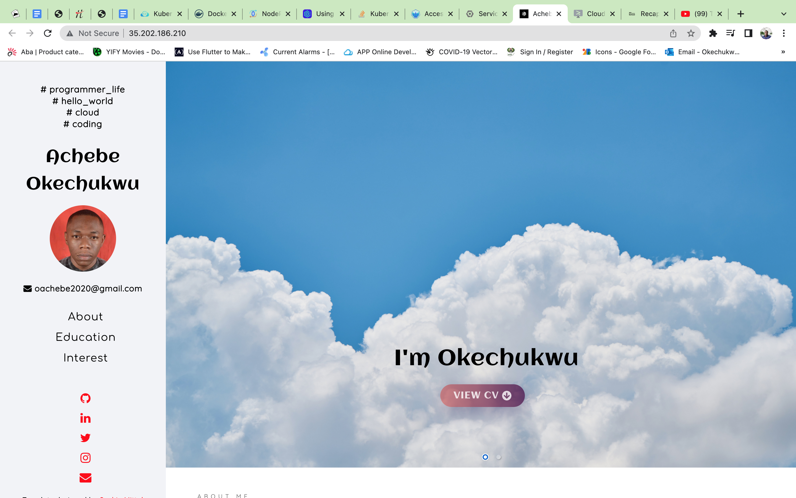
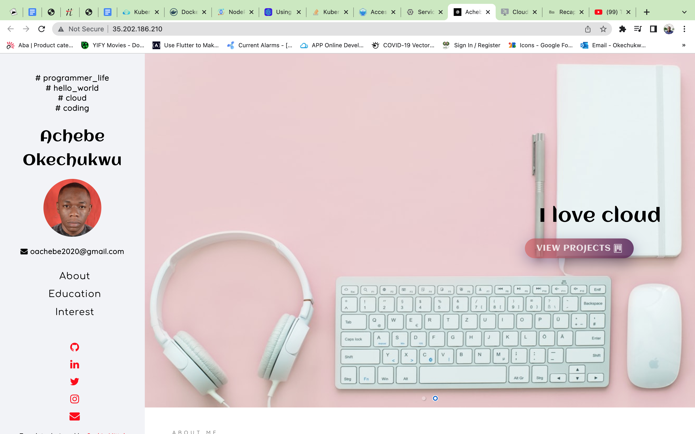

To run the app using the docker compose file
```
    docker compose build up
```
I have also uploaded the created image to my docker hub, you can access it using this command
```
    docker pull achebeh/my-react-portfolio
```
Also, if you wish to run the app on a kubernetes pod, you can deploy using this command.
```
    kubectl create -f /k8s/portfolio-deployment.yml
```
Then create its service to access the app externally with this command.
```
    kubectl create -f /k8s/portfolio-service.yml
```
Here is a what the app looks like running on my gcp kubernetes cluster.




